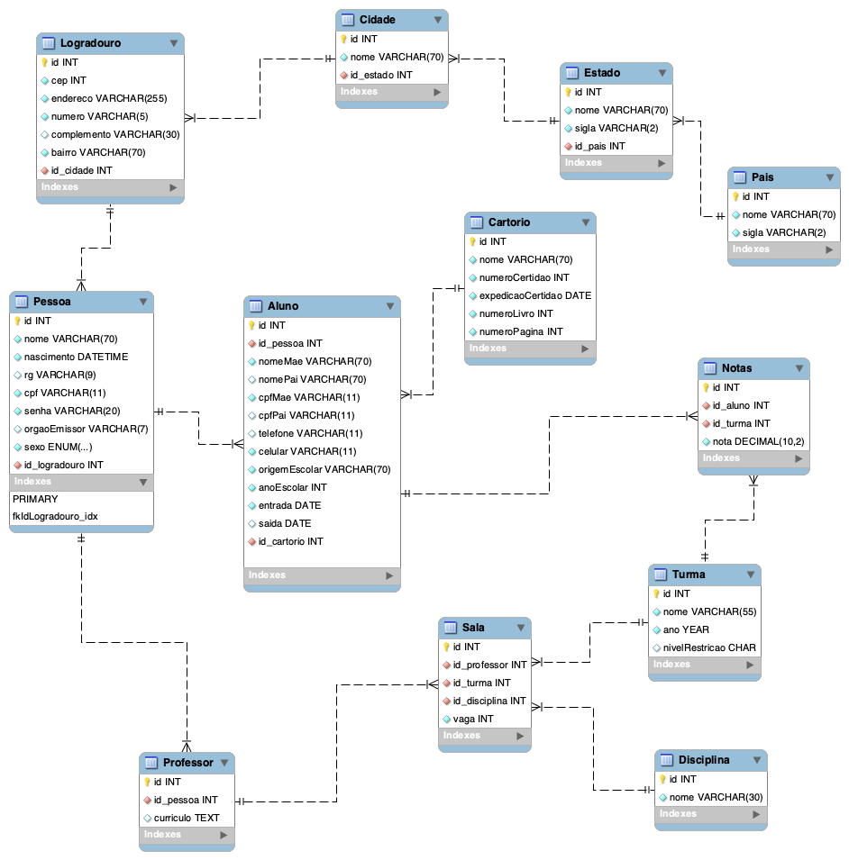

# Formação Java e Java EE

- 1/22 - Java parte 1: Primeiros passos (13, 14, 15 de Maio 2020) 8h :heavy_check_mark:
- 2/22 - Java parte 2: Introdução à Orientação a Objetos 8h :heavy_check_mark:
- 3/22 - Java parte 3: Entendendo herança e interface
- 4/22 - Java parte 4: Entendendo exceções :pino:
- 5/22 - Java parte 5: Pacotes e java.lang :pino:
- 6/22 - Java parte 6: Conhecendo o java.util :pino:
- 7/22 - Java parte 7: Trabalhando com java.io :pino:
- 8/22 - Java: Dominando as Collections :pino:
- 9/22 - Maven: Build do zero a web :pino:
- 10/22 - Servlet Parte 1: Fundamentos da programação web Java :pino:
- 11/22 - Servlet parte 2: Autenticação, autorização e o padrão MVC :pino:
- 12/22 - Java e JPA: Persista seus objetos com a JPA2 e Hibernate :pino:
- 13/22 - Java e JPA: Otimizações com JPA2 e Hibernate :pino:
- 14/22 - Spring MVC I: Criando aplicações web :pino:
- 15/22 - Spring MVC II: Integração, cache, segurança e templates :pino:
- 16/22 - EJB com Java EE 8: API Rest com WildFly 15 :pino:
- 17/22 - Java e JSF I: Sua aplicação web com JSF2 :pino:
- 18/22 - Java e JSF 2 - II: Componentes ricos com Primefaces :pino:
- 19/22 - Java e JSF 2 - III: Integração com CDI :pino:
- 20/22 - Java EE parte 1: Crie sua loja online com CDI, JSF, JPA :pino:
- 21/22 - Java EE parte 2: Sua loja online com HTML, REST e Cache :pino:
- 22/22 - Java EE parte 3: Finalizando sua loja com REST, JMS, JAAS e WebSockets :pino:

  Carga horária

  Estimada: 320h | Executada: 16h

## Fixando conteúdos Java

### Modelando classes

Aplicando os conhecimentos adquiridos nos cursos 1 e 2 da formação Java da Alura

#### Projeto Escola

Criado classes Java baseado no modelo er escola.

[Classes Projeto Escola](escola/src/escola)
